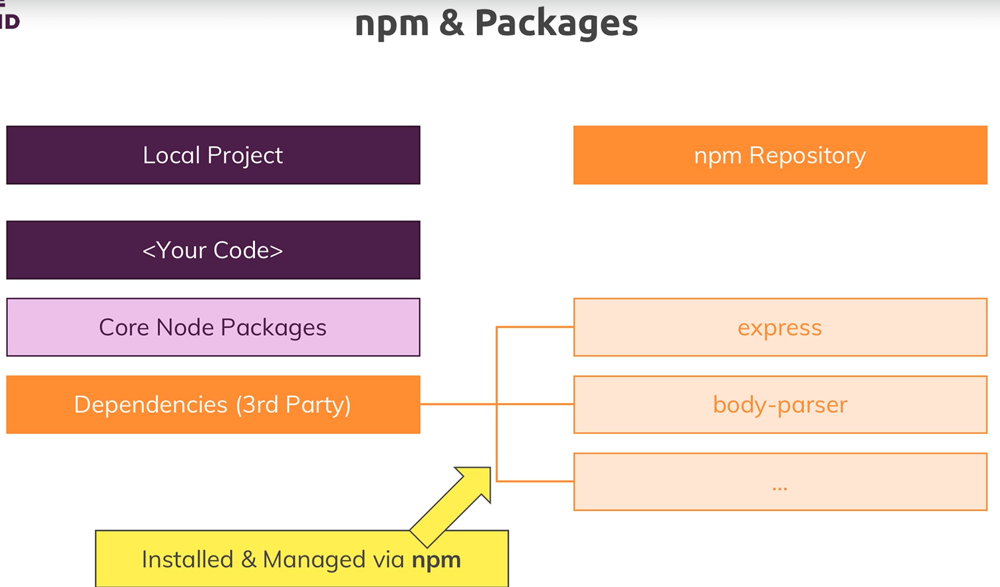
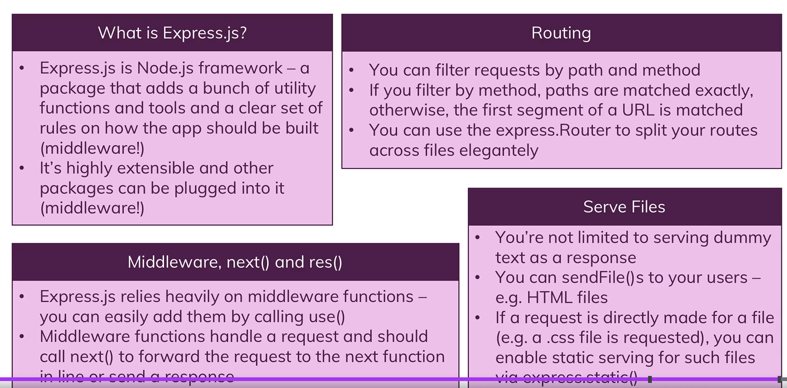
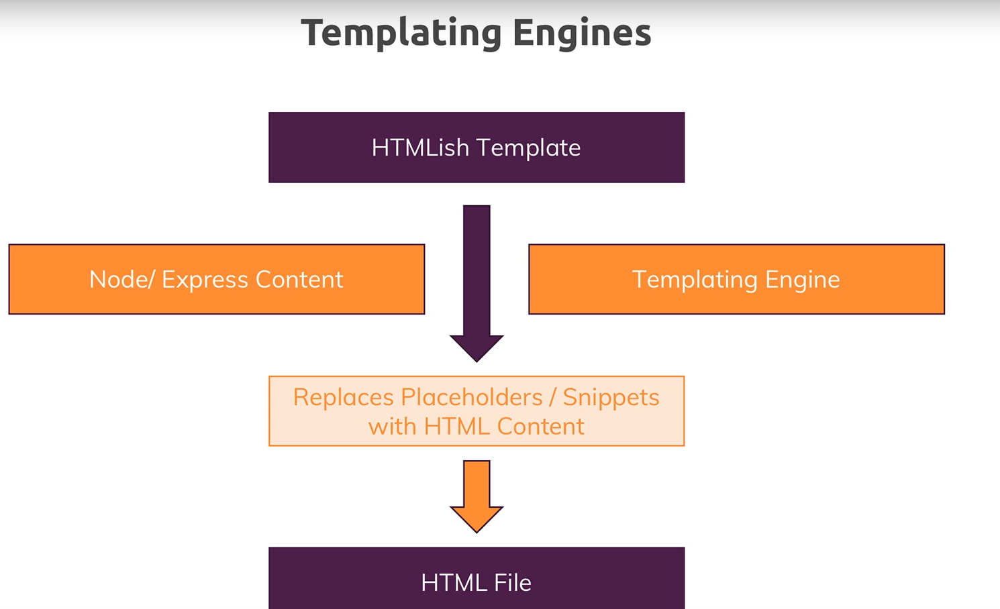
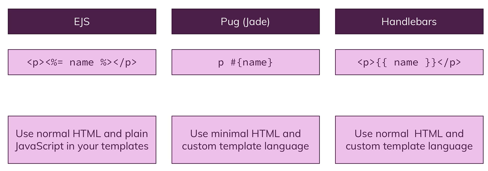
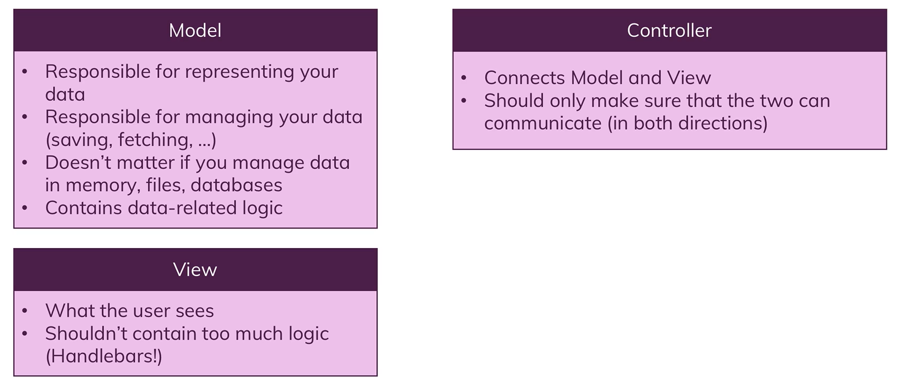
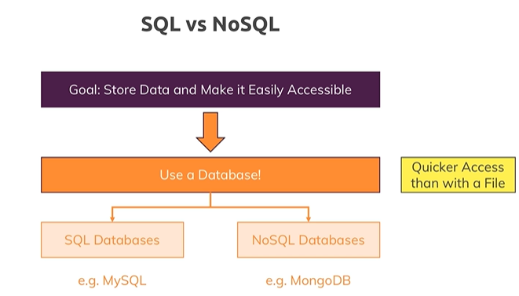
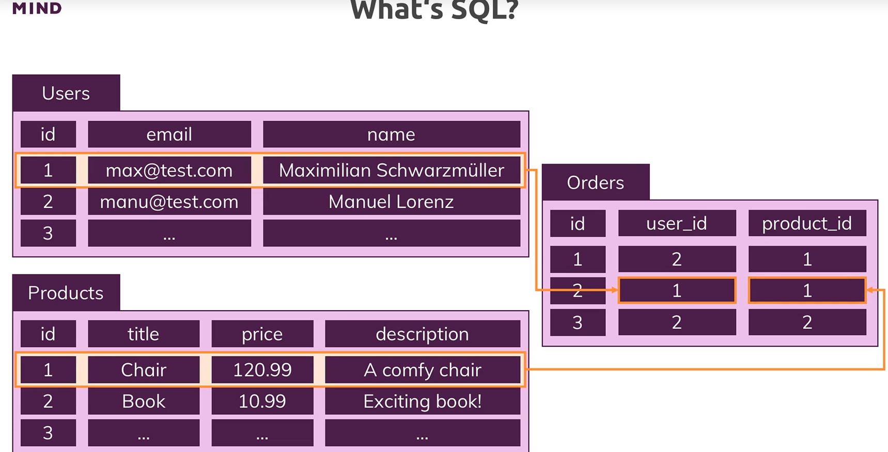
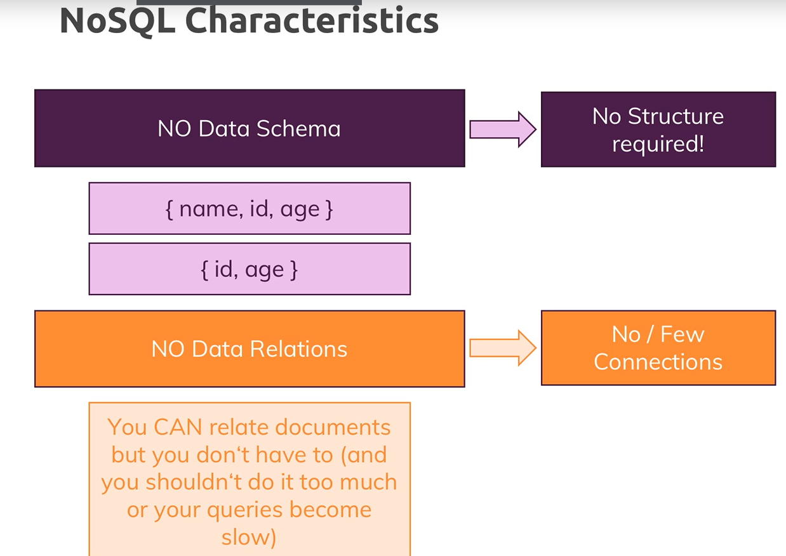
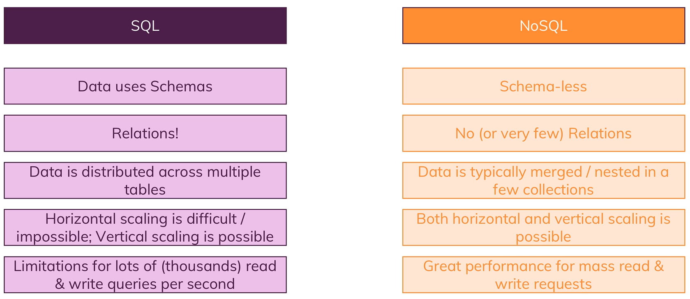
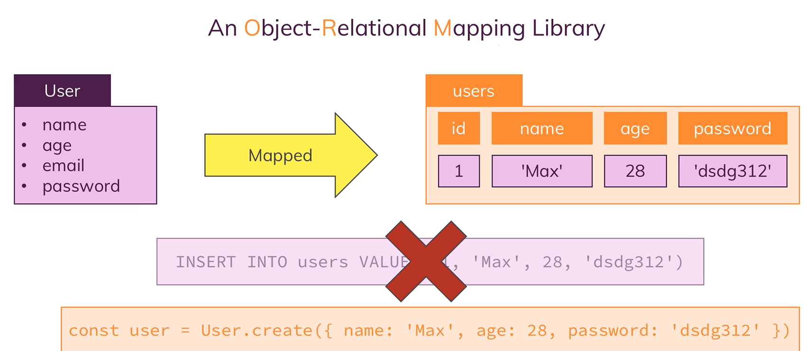

## Basics

# app.js file

- app.js or server.js is root file that makes our node js application
- In this we will create server
- run using node app.js
- There are core modules in nodejs (by default)
  - fs (file system)
  - path (helps in constructing path, paths to files or file system that work on any OS)
  - os (operating system)
  - http: (helpful when we create server & working with http requests & http responses); http helps with launching a server or sending requests (node app can send request to another server also, we can have multiple server communicate with each other)
  - https: helps in launching SSL encoded server
- require() is a way to import files in nodejs; it either takes file path or core module
- http: createServer method, it takes request listener as an argument; request listener is simply a function that will execute for every incoming request
- we will store http.createServer into const as server & listens it. listen() takes couple of argument 1st port, 2nd hostname etc
- process.exit() will de-register the createServer; It hard exit our event loop & therefore program shuts down

# Request & Response Headers

- On both requests and responses, Http headers are added to transport metadata from A to B.
- The following article provides a great overview of available headers and their role: https://developer.mozilla.org/en-US/docs/Web/HTTP/Headers

# Routing requets

- GET request is automatically sent when we click link or enter url
- POST request has to be set up by us by creating form
- https://expressjs.com/en/guide/routing.html

# Parsing requet bodies

- Incoming data is sent as stream of data that JS knows but JS doesn't
- 
- Buffer is a constrcut that allows us to hold multiple chunks & work with them before they are released once we are done

# Blocking & non blocking code

- fs.writeFileSync block code execution until file is created; even no incoming requests will be handled until file is completely created; It acceps the path & data as arguments
- fs.writeFile does not block the code execution; it takes 3rd argument also i.e a callback that should be executed when file creation is done

# Useful resources

- Official Node.js Docs: https://nodejs.org/en/docs/guides/
- Full Node.js Reference (for all core modules): https://nodejs.org/dist/latest/docs/api/
- More about the Node.js Event Loop: https://nodejs.org/en/docs/guides/event-loop-timers-and-nexttick/
- Blocking and Non-Blocking Code: https://nodejs.org/en/docs/guides/dont-block-the-event-loop/

# NPM scripts

- We can define some scripts in nodejs using npm
- npm init
- Set app.js as entry point file
- Add this to scipts in package.json : "start": "node app.js" (start is special reserved keyword) - npm stast is same as npm run start because start is reserved keyword for this
- If we add another "start-server": "node app.js" - for this we have: npm run start-server not npm start-server

# Installing 3 party packages (nodemon)

- 
- After making changes to our code we save it, exit the terminal & restart the server to see changes
- To get instant changes without quitting the server we install 3rd party 'nodemon'
- npm i nodemon --save-dev
- We wil change the start script from node app.js to nodemon app.js

# Global, core & 3rd party modeules

- Global Features vs Core Modules vs Third-Party Modules
  - Global features: Keywords like const or function but also some global objects like process
  - Core Node.js Modules: Examples would be the file-system module ("fs"), the path module ("path") or the Http module ("http")
  - Third-party Modules: Installed via npm install - we can add any kind of feature to our app via this way
    - Global features are always available, we don't need to import them into the files where we want to use them.
    - Core Node.js Modules don't need to be installed (NO npm install is required) but we need to import them when we want to use features exposed by them. Example:
      - const fs = require('fs');
      - We can now use the fs object exported by the "fs" module.
    - Third-party Modules need to be installed (via npm install in the project folder) AND imported. Example:
      - npm install --save express-session
      - In code file (e.g. app.js)
      - const sessions = require('express-session');

# Type of Errors

- Syntax Errors: If we have typo in our code or we forget any closing curly bracket or anything
- Runtime Errors: When we try to execute some code which will just break when it runs
- Logical Errors: App just doesn't work the way it should, techincally a logical issue

# Debugging: https://code.visualstudio.com/docs/nodejs/nodejs-debugging

# Useful resources:

- More on debugging Node.js: https://nodejs.org/en/docs/guides/debugging-getting-started/
- Debugging Node in Visual Studio Code: https://code.visualstudio.com/docs/nodejs/nodejs-debugging

## Express.js

- Nodejs framework
- npm i --save express
- Expressjs is all about middleware i.e an incoming request is automatically funneled through bunch of functions by expressjs
- 
- use function of express() allows us to add new middleware function. It accepts array of request handlers
- We can pass function inside use(), it take 3 arguments: req, res, next; next is a function that will be passed to this function by express

# Handling routes

- We can add route path at the beginning of use()

# Parsing incoming requests

- by default request doesn't try to parse the incoming request body, therefore we need to register parser
- Express by default used to have body-aprser pckg inside it, then they removed & then again re-added, but we will install it
- npm i --save body-parser
- bodyParser.urlencoded({ extended: false }) registers a middleware; { extended: false } to set confg , to enable bodyparser
- app.get() will get fored for only incoming requests
- GET : app.get(); POST: app.post(); also we have put, patch, delete

# Express router

- express.Router(), store it in a const router
- router.use for all requests; router.get for GET, .post for POST etc
- .get macthes the exact route but .use does not

# Filtering methods

- It allows us to put a common starting segment for our path which all routes in a given file use to outsource that into app.js so that we don't have to repeat it for all routes in other files

# Crearting HTML pages

- We manage our VIEWS, that we want to serve to the user in one place of application in views folder
- path.join() yields us path in the end, by concatenating different segments; '\_\_dirname' is a global variable which simply holds the absolute path on our OS to the project folder
- We can create helper function in util as global path in path file.
- We can serve files statically also from public folder
- 

## Working with dynamic content & adding template engines

# Templating Engines (TE)

- To put dynamic content into our HTML pages
- Useful resources:

  - Pug Docs: https://pugjs.org/api/getting-started.html
  - Handlebars Docs: https://handlebarsjs.com/
  - EJS Docs: http://ejs.co/#docs

- 
- Different Tamplating engines: EJS, Pug(Jade), Handlebars
- 
- npm i --save ejs pug express-handlebars

# Pug

- app.set() allows us to set any values gloablly on our express application & get it later
- 'view engine' is default engine extension to use which allows to tell express that any dynamic template that we ar trying to render, use that only
- 'views' allows to tell express where to find dynamic views
- .render() will use default templating engine
- https://pugjs.org/api/getting-started.html
- block & extends for common pug file & to use it anywhere, we can name anything with block like block style & use it as block style where we extend another pug file

# Handlebars

- pug is auto installed by express therefore no need to import pug, but we need to import handlebars
- app.engine() resgister new TE
- For common layout we mention its path in app.engine()

# EJS

- It is supported by express, therefore no need to import
- It does not support layouts

# Layouts with partials

- For this we make separated shared files

## MVC (Model View Controller)

- It is for separation of concerns
- 
- 
- https://developer.mozilla.org/en-US/docs/Glossary/MVC

# Dynamic Routing

- 

## DB

- 

# SQL

- SQL DB thinks in tables & in each table we have fields or columns; fileds is fill in by data or records or rows
- SQL DB allow us to relate different tables; Eg: order can be desribed as connection betweem user & product (relation)
- So we have relations in SQL DB
- 
- Core characteristics of SQL
  - Strong data schema: for each table we clearly define how data in there should look like, which fields, which data type & all data in table has to fit the schema
  - Data relations: one-to-one, one-to-many, many-to-many; tables are connected
- SQL is structured query language; Queries are simply commands we use to interact with DB;Eg: SELECT \* FROM users WHERE age > 25

# NoSQL

- In this we have tables (Eg: users & orders); Tables are called collections
- In collections we don't have records but have documents (documents are very similiar as objects in JS)
- NoSQL doesn't have strict schema; 2 documents in single collection can have different schema Eg: 1 collection have age but other doesn't
- We can store multiple documents with different structures in same collection.
- 
- In this we have no real relations, instead we can have duplicate data. Eg: we can have user in users & user in orders collection also; If the data changes then we have to update it in multiple places, but this is ok because if we ever have to retrieve data we don't have to join multiple tables
- We can get all the data at one place in orders collection of user as well as of order; therefore data retrieval is fast
- 
- As application grows we need to store more data & access more data frequently therefore we might need to scale our DB servers.

# Horizaontal vs Vertical Scaling

- HS
  - In this we add more & more servers & we can do this infinitely;
  - We can buy new servers(on cloud provider or own data center) & connect to our DB & split our data across all the servers
- VS
  - We make our exisiting server more stronger by adding more CPU or memory
  - But problem is that we have some limit, we can't fit infinitely much CPU power into single machine
- 
- 
- If we are storing data where relations are really important, want strong schemas, & want split up tables then SQL is perfect; also not every part of data is accessed multiple times per second; If data does not change that often then SQL is good.
- If we have data that changes frequently then we can use NoSQL, there, relations might not be important because we can always put all information that belongs to shopping cart or to an order in one single document

# MySQL

- Install msi
- After installation of workbech, server & shell, connect our app to MySQL
- npm i --save mysql2 (It allows us to write SQL code in node)
- https://github.com/sidorares/node-mysql2
- We should close the connection when we are done with the query but problem is we have to run multiple queries & we need to re-execute the code to connection for every new query again & again -> inefficient
- Therefore we create connection pool which return the promise

# Sequelize

- It is an Object Relational Mapping Library
- 
- Sequelize offers us models to work with our DB
- We then instantiate these models, then we can run queries on that & we can also associate our models
- 
- npm i --save sequelize (It needs mysql2 pckg which we have already installed)
- sync method in sequelize looks at all the model that we defined & then creates table for them
- If we run our server again it again execute the models but will not overwrite the tables as in there we automatically have if not exists
- create: it creates a new elt based on model & immediately saves it to DB
- build: it also create new elt based on model but only in JS & then we need to save it manually
- findAll: find all the rows of tables
- fundById/findByPk: find specific row with id
- save: update the existing row, if no row then create new one
- destroy: delete the row
